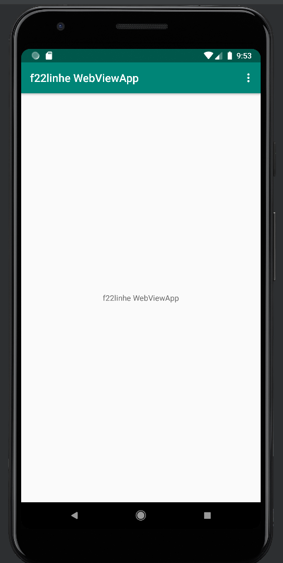
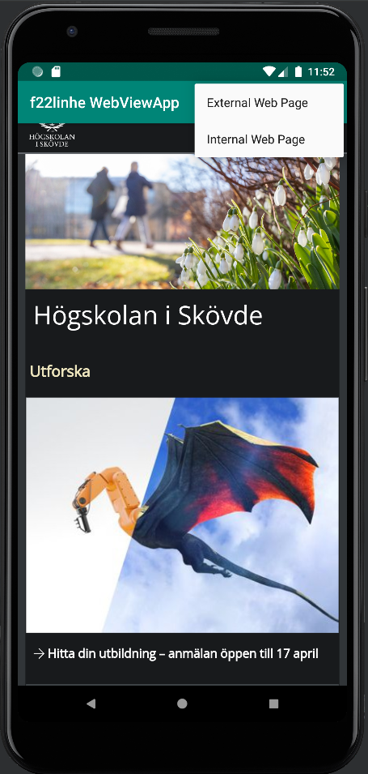
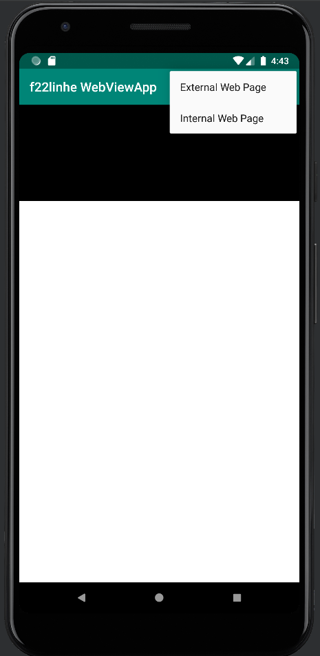

Programmering av mobila applikationer - Rapport "WebView"

För att byta namn på appen navigerar jag mig till App -> Resources -> Values -> strings.xml. För att kunna ändra namnet måste jag ändra värdet på stärngen som heter "app-name".
Istället för namnet "WebViewApp", ändrar jag det till "f22linhe WebViewApp". Jag klickar på Commit och lägger på så sätt till mina ändringar i koden. Därefter pushas dem upp till 
Github genom att jag klickar på Push. Se Figur 1.

```
<resources>
    <string name="app_name">f22linhe WebViewApp</string>
    ...
</resources>

```

Appen behöver tillgång till Internet och därför behöver kod läggas till i AndroidManifest.xml. För att ta mig dit går ajg via App -> Manifest -> AndroidManifest.xml. För att kunna ge appen tillåtelse 
att använda sig at nätet används elementet <uses-permission>, jag specificerar vad jag vill ge tillåtelse till genom att ange "android.permission.INTERNET" som namn för elementet. 

För att en annan app (i detta fall en web browser) ska kunna starta inuti appen måste den ha tillåtelse till att kunna starta en komponent i appen. I detta fall activity.
Under taggen <activity> används därför attibutet android:exported och värdet sätts till "true". Nu kan andra appar startas inuti appen.

```
...
<uses-permission android:name="android.permission.INTERNET" />
...
<activity
     ...
     android:exported="true">
...

```


Om vi ska kunna visa en intern eller en extern webbsida genom vår app måste vi först ha ett objekt/View som kan visa detta, och eftersom detta objekt är något som ska visas
så tillhör den därför vår layout. För att komma till layouten för appen går vi via App -> Resources -> Layout -> Activity_main.xml. Enligt uppgiftsbeskrivning ska nuvarande 
TextView som redan finns i koden bytas ut. Vi byter ut den mot en WebView. Med attibutet android:layout_width kan vi bestämma bredd på elementet/Viewen/objektet, och med
attibutet android:layout_height kan vi bestämma höjd. Genom att sätta dessa till "match_parent" kommer de ha samma bredd och höjd som sina föräldrar. Objektet behöver också 
ett ID/namn för att kunna identifieras för anrop. Med attirbutet android:id kan vi ge objektet ett namn genom att sätta värdet för attributet till "+id/My_WebView", där det 
namn jag valt är "My_WebView". 

```

<WebView
     android:id="@+id/My_WebView"
     android:layout_width="match_parent"
     android:layout_height="match_parent" />

```


Vi har nu skapat ett objekt som ska fungera som en behållare för ska kunna visa en webbsida genom vår app men, en bildruta skulle man kunna säga. Nu behöver vi själva innehållet som ska visas.
Vi skapar därför en lokal variabel som vi döper till myWebView av typen WebView. Klassen WebView är själva elementet som vår websida kommer att visas genom.
För att typen WebView ska kännas igen av programmet måste vi även importera klassen WebView. Detta görs genom att attributet import, vi väljer sedan android.webkit.Webview.

```
...
import android.webkit.WebView;
...
public class MainActivity extends AppCompatActivity {

    WebView myWebView;

```


Nu kopplar vi samman variabeln myWebView med objektet My_WebView genom findViewById. För att webbsidan ska öppnas inuti appen, d.v.s. att inget nytt fönster öppnas när webbsidan startar
att använder vi oss utav setWebViewClient och väljer metoden new WebViewClient(). Därefter vill vi göra lite inställningar för vår variabel. Vi vill ge JavaScript tillåtelse att exekveras 
för att kunna interagera med webbsidan/webbsidorna.
Även här behöver klasserna WebViewClient och WebSettings importeras för att programmet ska kunna igen klasserna. 

```
...
import android.webkit.WebSettings;
...
import android.webkit.WebViewClient;
...
@Override
    protected void onCreate(Bundle savedInstanceState) {
        ...
        myWebView = findViewById(R.id.My_WebView);
        myWebView.setWebViewClient(new WebViewClient()); // Do not open in Chrome!
        WebSettings webSettings = myWebView.getSettings();
        webSettings.setJavaScriptEnabled(true);
    }

```


När användaren klickar på ett alternativ i dropdown menyn/hemknappen ska denne kunna välja på om den vill besöka en extern webbsida eller en intern webbsida. Därför behöver vi en funktion som utförs när 
ett visst villkor uppfylls. Om användaren klickar på "External Web Page" kommer funktionen showExternalWebPage att starta och URL:en https://his.se kommer att laddas in. Om användaren klickar 
på "Internal Web Page" kommer funktionen showInternalWebPage att starta och URL:en file:///android_asset/ kommer att laddas in.

```
public class MainActivity extends AppCompatActivity {

    WebView myWebView;

    public void showExternalWebPage(){
        myWebView.loadUrl("https://his.se");
    }

    public void showInternalWebPage(){
        myWebView.loadUrl("file:///android_asset/");
    }
    
```


När användaren klickar på ett av alternativen i dropdown menyn/hemknappen kommer som ovan nämnt en funktion att starta. Beroende på vilket villkor som uppfylls så kommer en av de två funktionerna att starta.
Om användaren klickar på "External Web Page" så uppfylls villkoret för den övre if-satsen. ID:et motsvarar då "action_exernal_web", vilket innebär att if-satsen kommer att anropa funktionen showExternalWebPage. Se Figur 2.
Om ID:et motsvarar "action_internal_web" så uppfylls villkoret för den undre if-satsen och då kommer funktionen showInternalWebPage att anropas. Se Figur 3.

```
@Override
public boolean onOptionsItemSelected(MenuItem item) {
int id = item.getItemId();

        //noinspection SimplifiableIfStatement
        if (id == R.id.action_external_web) {
            showExternalWebPage();
            Log.d("==>","Will display external web page");
            return true;
        }

        if (id == R.id.action_internal_web) {
            showInternalWebPage();
            Log.d("==>","Will display internal web page");
            return true;
        }
...

```


Figur 1: Ändrade namn på appen.



Figur 2: External Web Page.



Figur 3: Internal Web Page.


